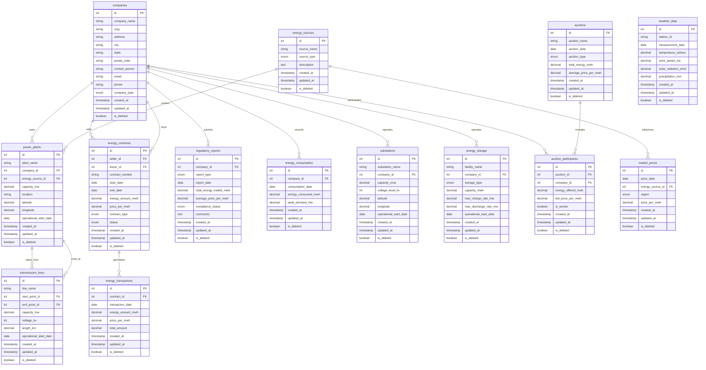

# 🌞🔌 Brazil's Electrifying Energy Market Classes 🔌🌞

Welcome to the most high-voltage educational experience on GitHub! This repo is where we, two energy-obsessed students, are powering up our knowledge of Brazil's secondary energy market. Prepare to get charged up with learning!

## 📚 What's on the Curriculum?

Dive into a world where power plants are your textbooks, energy contracts are your pop quizzes, and market prices are your final exams. We're exploring every amp and volt of the Brazilian energy sector!

## 🧰 Our Learning Toolkit

- `data-generator.py`: Our hands-on lab for creating real-world energy market scenarios.
- `ddl.sql`: The foundation of our studies - a database schema that's more comprehensive than a power grid!

## DB Mermaid:

## 🚀 Course Highlights

- Master the art of Brazilian energy company structures
- Become a power plant expert (hard hat not included)
- Decode energy contracts like a pro
- Surf the waves of price fluctuations
- Learn the gentle art of soft deletes in databases

## 🎓 How to Join Our Virtual Classroom

1. Clone this repo (no running in the halls!):

git clone https://github.com/your-username/brazil-energy-market-classes.git

2. Install the required libraries (they're essential reading):

pip install pymysql faker

3. Set up your MySQL database (think of it as your digital notebook)
4. Configure `DATABASE_CONFIG` in `data-generator.py` with your credentials
5. Run the script to start your practical session:

python data-generator.py

## 🧑‍🔬 Learning Objectives

We're amping up our skills in:
- Database design (more complex than a power distribution network)
- Python programming (generating data faster than a turbine)
- Energy market dynamics (because it's more thrilling than the stock market)

## 🚧 Disclaimer: This is a Learning Zone

All content is for educational purposes. We're here to learn, not to run actual power systems. Let's keep our experiments in the classroom!

## 🤝 Class Participants

- @EnergyScholar1 - The Ohm-niscient One
- @WattWizard2 - Voltage Virtuoso

## 📜 Academic License

This project operates under the "E = mc² (Education = more class content²)" License. Use it to amplify your learning!

---

Remember: In our classes, we're generating knowledge, not just electricity! Let's learn and grow brighter together! ⚡️📖
