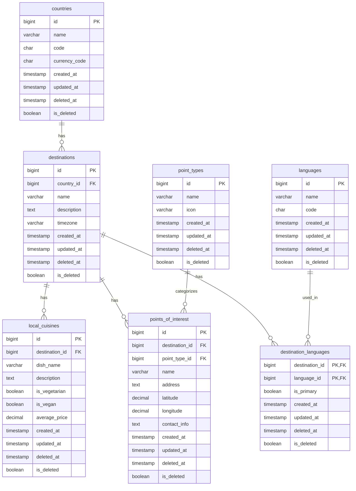
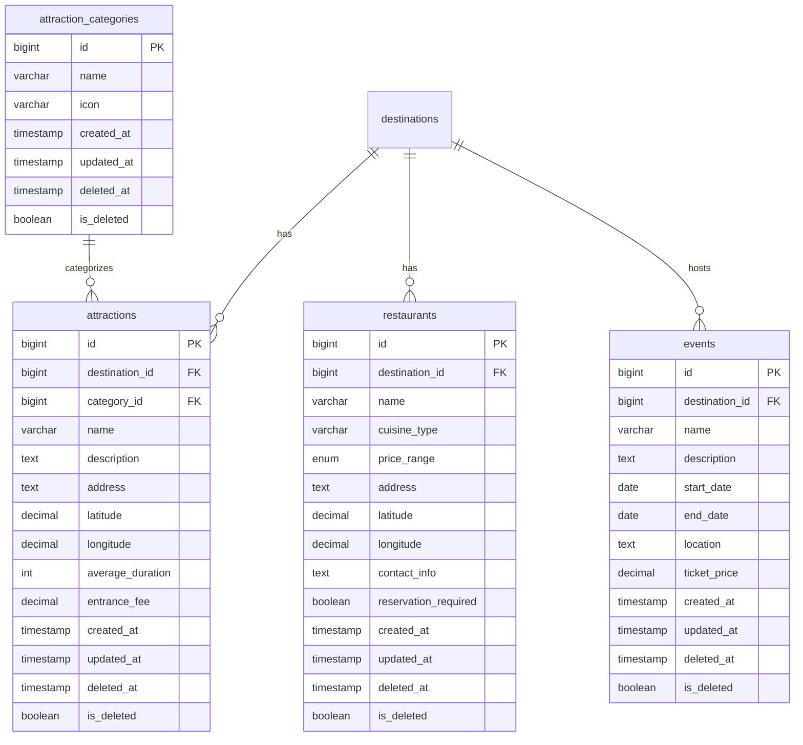
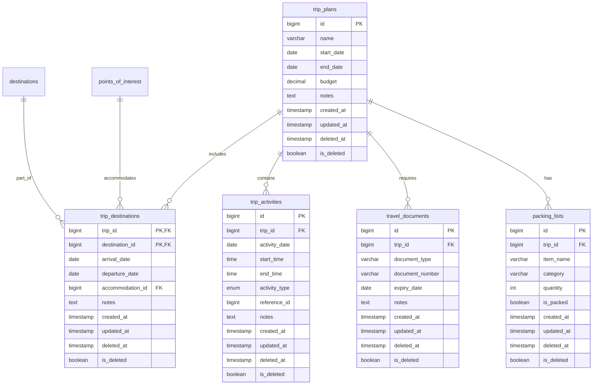

# 🔍💼 Business Intelligence Bootcamp: Energy Market Edition

Welcome to the most electrifying Business Intelligence (BI) course on GitHub! We're using Brazil's secondary energy market as our case study to power up your skills in Python, pandas, Jupyter Notebook, and SQL. Get ready to energize your data analysis career!

## ⚡ Our High-Voltage Curriculum

Dive into a world where data flows like electricity, transforming raw information into powerful insights. We're not just learning about energy - we're supercharging your BI skills!

## 🛠️ Our Analytical Toolkit

- `data-generator.py`: Your power source for creating rich, realistic datasets
- `ddl.sql`: The blueprint for our database, ready for your SQL expertise
- Jupyter Notebooks: Where we'll conduct our electrifying analyses (coming soon!)

## 🚀 Course Highlights

- Master Python: Your swiss army knife for data manipulation
- Become a pandas pro: Handle data with the agility of a power grid operator
- SQL sorcery: Query your way through complex data relationships
- Jupyter Notebook mastery: Create stunning, interactive reports
- Real-world BI application: Using energy market data to drive decisions

## DB Mermaid:

## 🔌 How to Connect to Our BI Grid

1. Clone this high-energy repo:

git clone https://github.com/your-username/bi-bootcamp-energy-market.git

2. Install your analytical power tools:

pip install pymysql faker pandas jupyter

3. Set up your MySQL database (your personal data powerhouse)
4. Configure `DATABASE_CONFIG` in `data-generator.py`
5. Generate your dataset:

python data-generator.py

6. Fire up Jupyter Notebook and start your analysis!

## 🧠 Learning Objectives

We're amping up your skills in:
- Data manipulation with Python and pandas
- Database querying and management with SQL
- Data visualization and reporting with Jupyter Notebooks
- Business intelligence concepts and applications
- Critical thinking and problem-solving in a business context

## 🚧 Disclaimer: Real Tools, Simulated Data

While we use real BI tools, our energy market data is simulated. Perfect for learning without real-world consequences!

## 🤝 Your BI Power Team

- @DataDynamo1 - Master of Metrics
- @InsightIlluminator2 - Visualization Virtuoso

## 📜 Open-Source License

This project is open-source under the MIT License. Use it to power up your learning and career!

---

Remember: In BI, we turn data into decisions. Let's light up the path to data-driven insights together! 💡📊